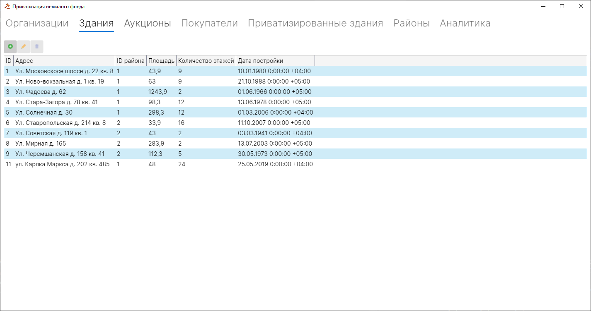
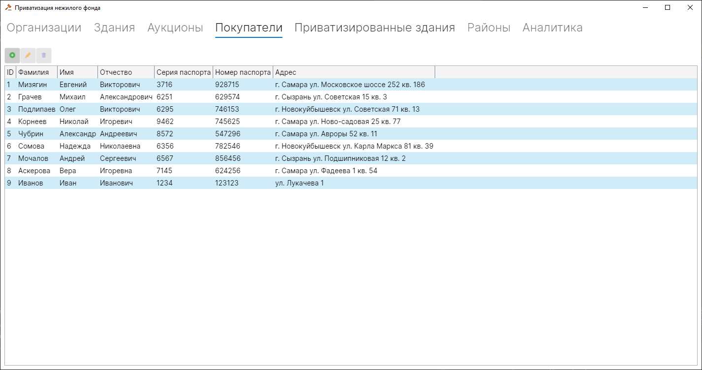
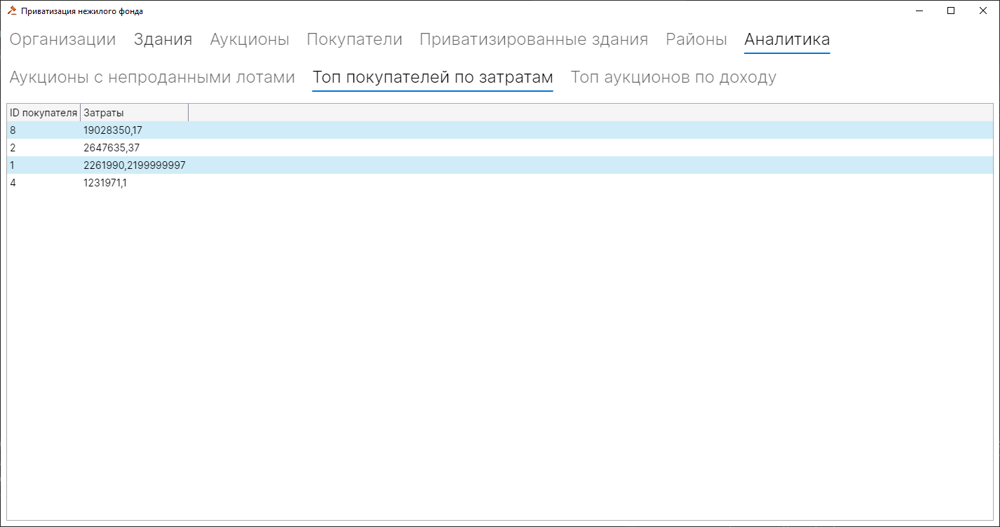
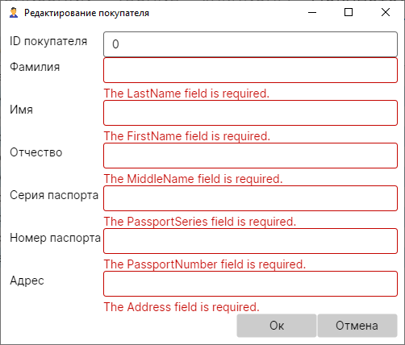

# Промышленное программирование
# Лабораторные работы 2023

### Приватизация нежилого фонда
## Задание
В городском комитете по имуществу имеются сведения о нежилом фонде и факте приватизации некоторых зданий. Каждое здание имеет регистрационный номер, характериуется адресом с указание района, площадью, количеством этажей, датой постройки.
Приватизация производится на аукционе нежилого фонда. Одно и то же здание может выставляться на нескольких аукционах, на одном аукционе - несколько зданий. Аукцион характеризуется датой проведения, организацией, проводящей аукцион.
Каждое приватизированное здание характеризуется датой продажи, первоначальной аукционной стоимостью, конечной стоимостью, данными о покупателе. Данные о покупателе включают ФИО, номер паспорта, адрес.

Запросы:
1) Вывести информацию о всех покупателях.
2) Вывести информацию по аукционам, на которых не были проданы все здания.
3) Вывести сведения о покупателях, получивших нежилой фонд по некоторому району города, и общую сумму приватизированного фонда района. Упорядочить по ФИО.
4) Найти адреса всех покупателей, участвующих в аукционе указанного числа(даты).
5) Вывести топ 5 покупателей, потративших больше всего денежных средств.
6) Вывести данные об аукционах, принесших наибольшую прибыль(суммарную разницу между первоначальной и конечной стоимостью).

### Реализация клиентского приложения
## Главное окно с отображением здания

## Главное окно с отображением покупателя

## Главное окно с аналитикой

## Окно добавления и редактирования покупателя

## Окно добавления и редактирования здания

