# Кадры предприятия
### Исходные данные
В отделе кадров предприятия хранятся данные о каждом сотруднике:
- регистрационный номер, 
- фамилия,
- имя,
- отчество,
- дата рождения,
- пол,
- дата поступления на работу,
- цех \(справочник),
- отдел \(справочник),
- занимаемая должность \(справочник),
- домашний адрес,
- рабочий телефон,
- домашний телефон,
- семейное положение,
- число человек в семье,
- число детей.

Один сотрудник может числиться в нескольких отделах.
Отдел кадров хранит архив данных о трудовой деятельности сотрудника:
- дата приема на должность,
- дата увольнения с должности.

Каждый сотрудник может быть членом профсоюза. Профсоюз хранит информацию за последние три года о сотрудниках, получивших льготные путевки в:
- санаторий,
- дом отдыха,
- пионерский лагерь предприятия.

### Запросы:
1) Вывести всех сотрудников выбранного отдела.
2) Вывести сотрудников, работающих в нескольких отделах, упорядочить по ФИО.
3) Вывести архив об увольнениях, включающий регистрационный номер, ФИО, дату рождения, цех, отдел, занимаемую должность.
4) Вывести средний возраст сотрудников в каждом отделе.
5) Вывести сведения о сотрудниках, получавших в прошлом году льготные профсоюзные путевки (с запросом вида путевки).
6) Вывести топ 5 сотрудников, имеющих наибольших стаж работы на предприятии.

# Графический интерфейс
### Основное окно
###### База данных "Workers" \(Сотрудники)
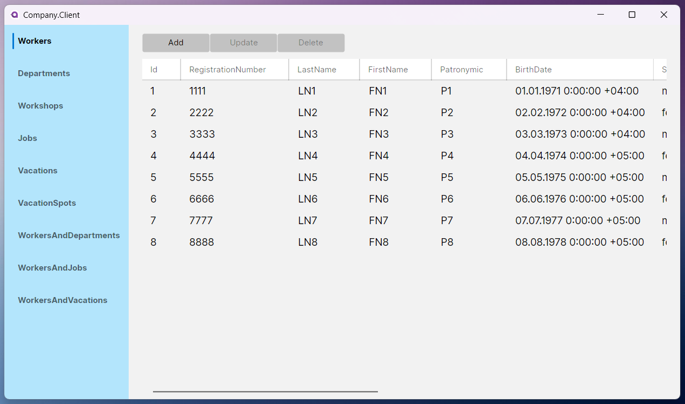
###### База данных "Departments" \(Отделы)
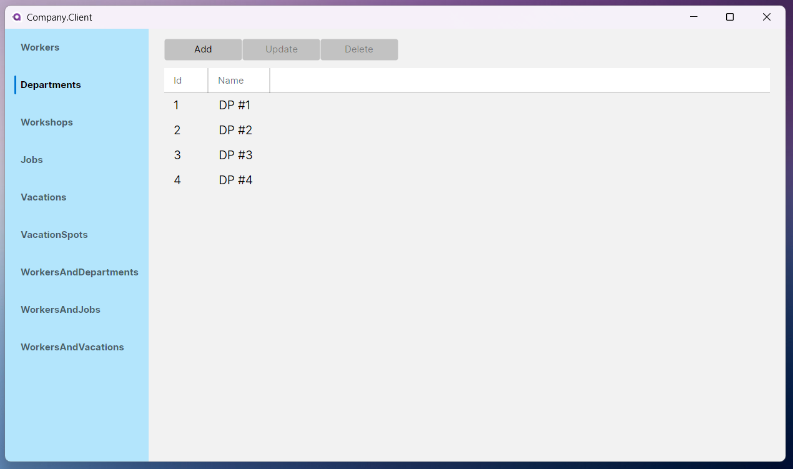
###### База данных "Workshops" \Цехи)
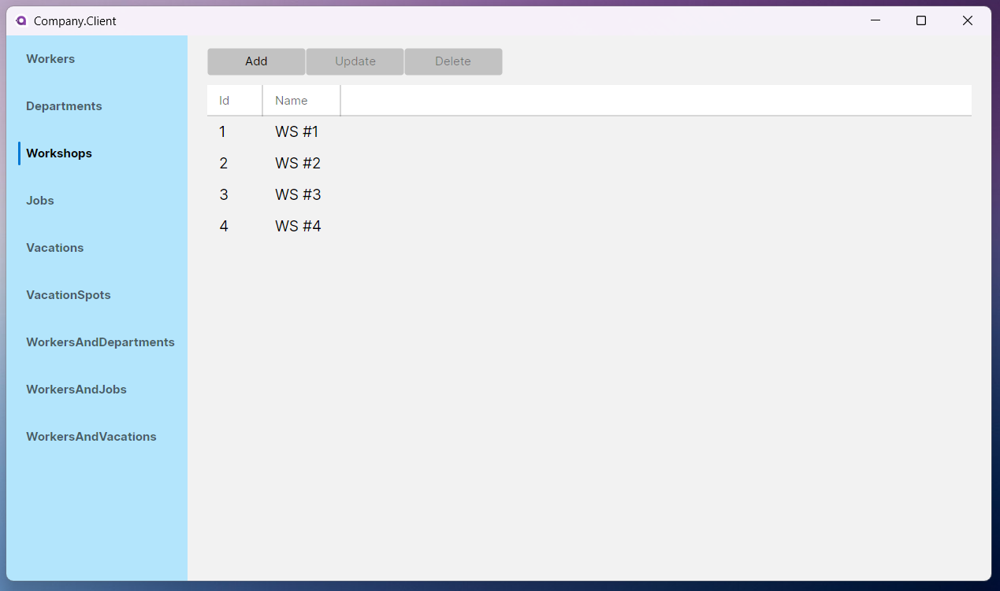
###### База данных "Jobs" \(Должности)
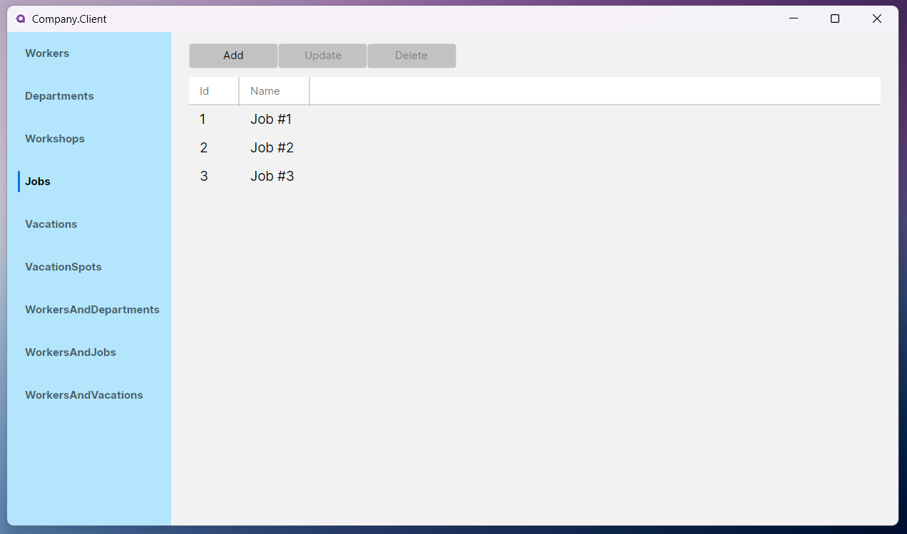
###### База данных "Vacations" \(Путёвки)
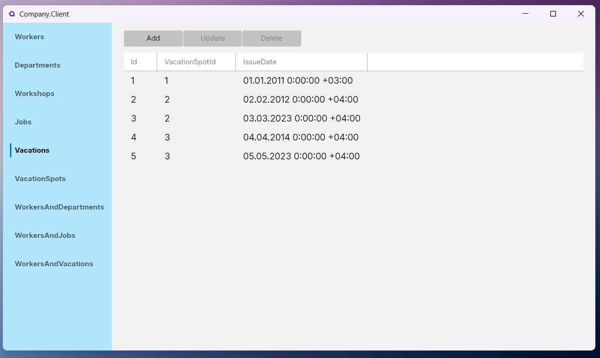
###### База данных "VacationSpots" \(Виды путёвок)
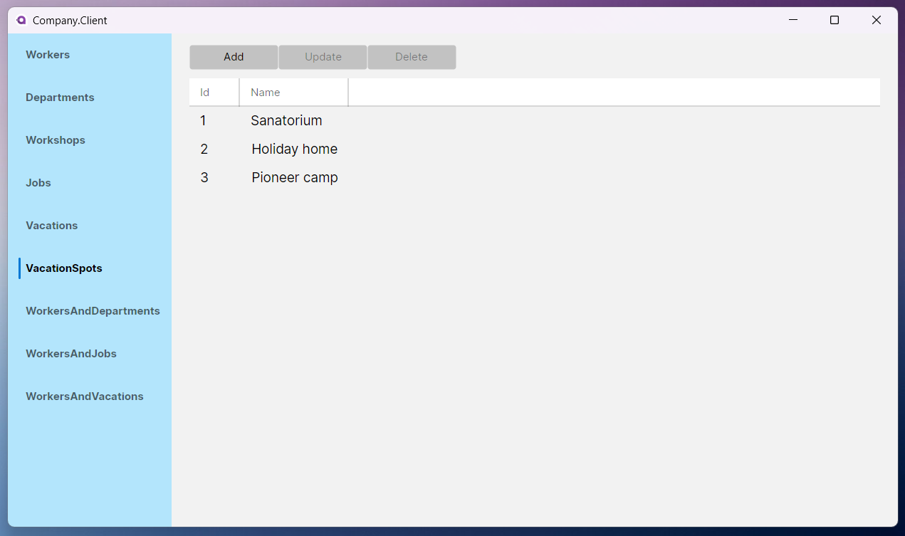
###### База данных "WorkersAndDepartments" \(Связь Сотрудник-Отдел)
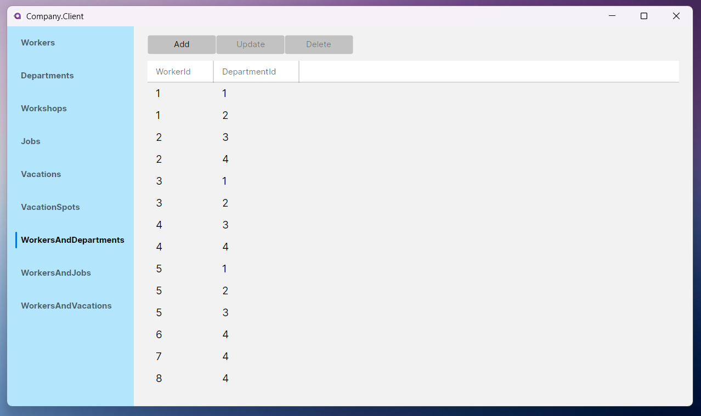
###### База данных "WorkersAndJobs" \(Связь Сотрудник-Должность)
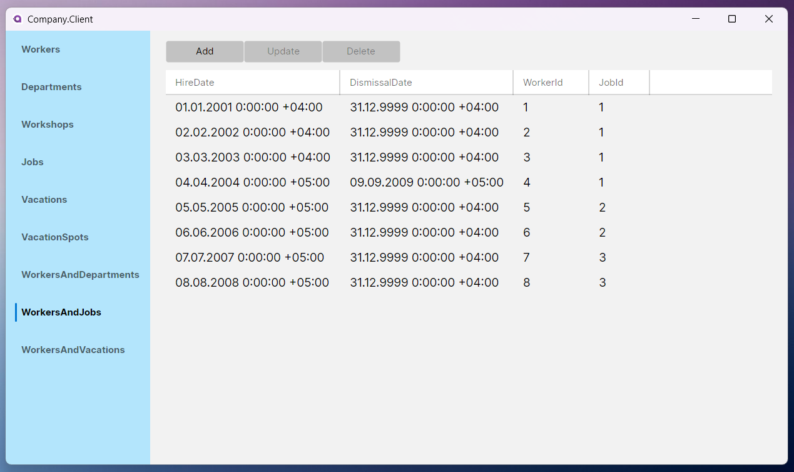
###### База данных "WorkersAndVacations" \(Связь Сотрудник-Путёвка)
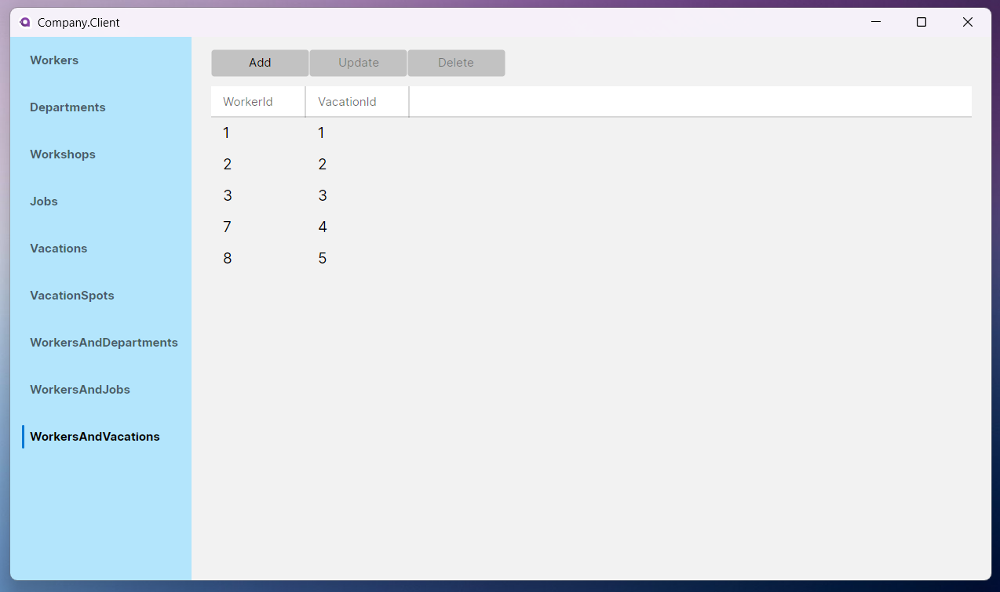

### Окна добавления/изменения записей
###### Добавление/изменение записи базы данных "Workers"
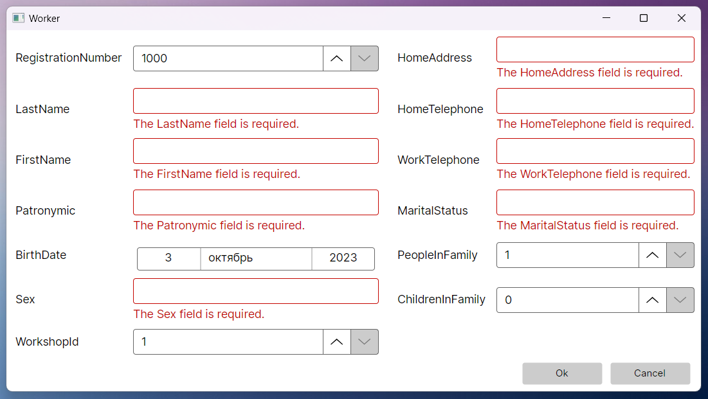
###### Добавление/изменение записи базы данных "Departments"
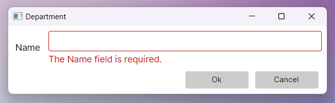
###### Добавление/изменение записи базы данных "Workshops"
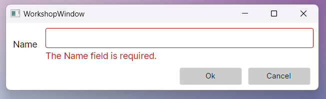
###### Добавление/изменение записи базы данных "Jobs"
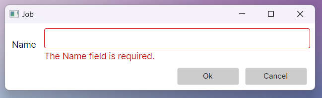
###### Добавление/изменение записи базы данных "Vacations"
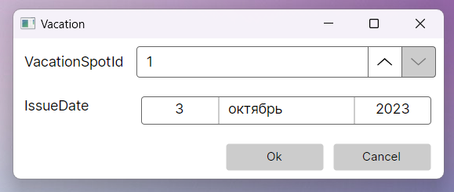
###### Добавление/изменение записи базы данных "VacationSpots"
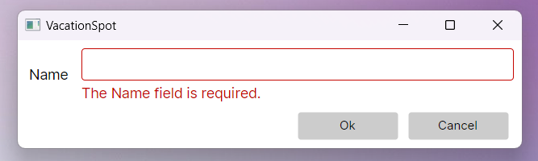
###### Добавление/изменение записи базы данных "WorkersAndDepartments"
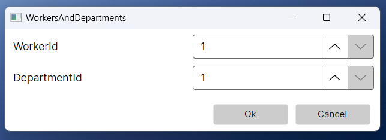
###### Добавление/изменение записи базы данных "WorkersAndJobs"
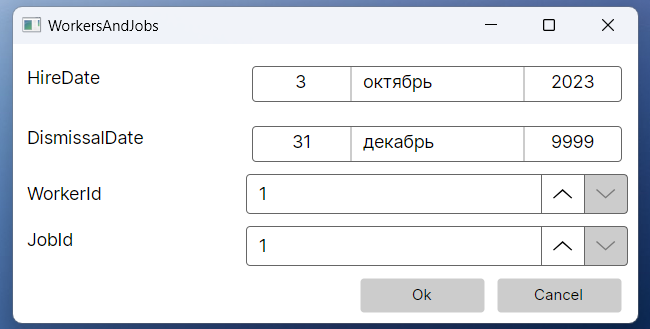
###### Добавление/изменение записи базы данных "WorkersAndVacations"
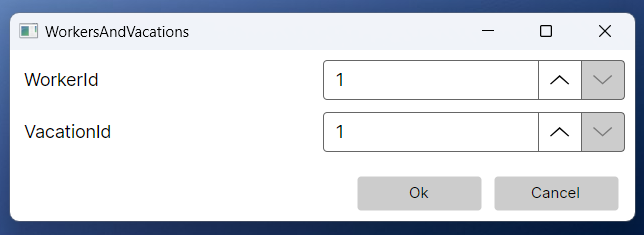