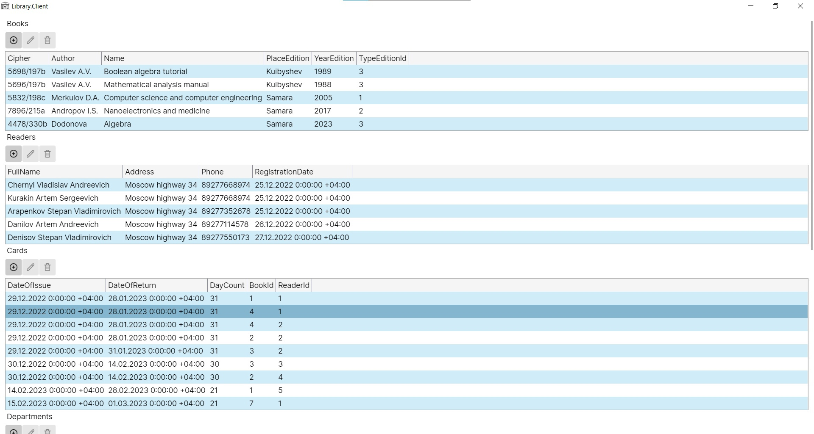
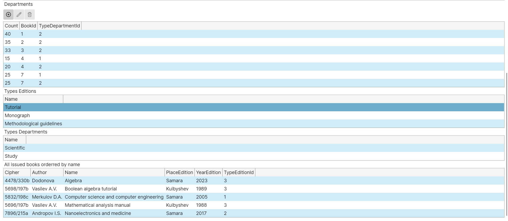
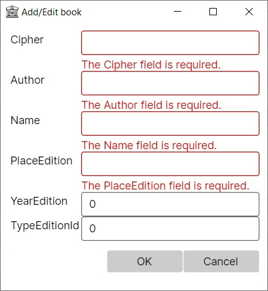
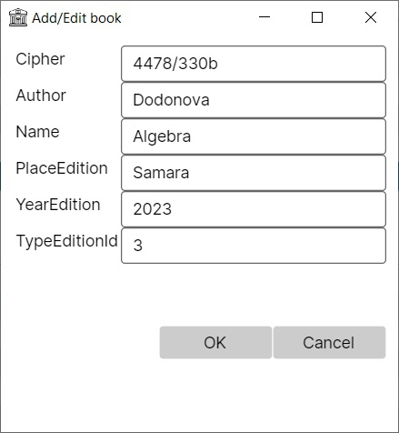
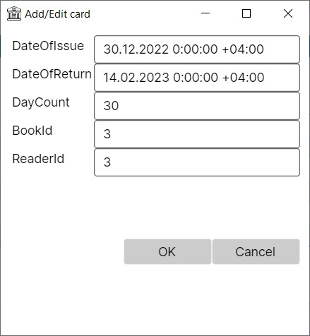
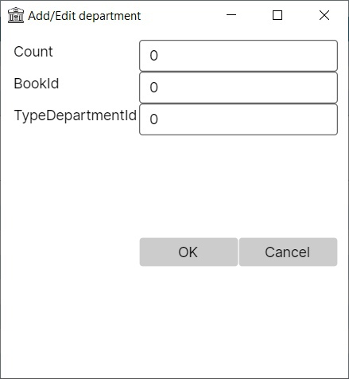
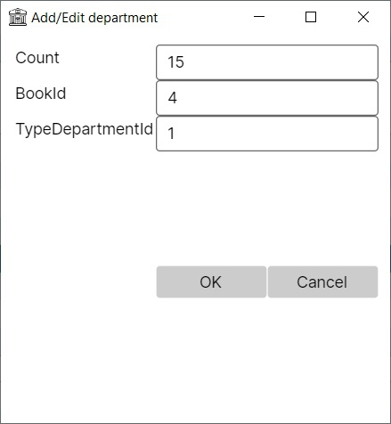
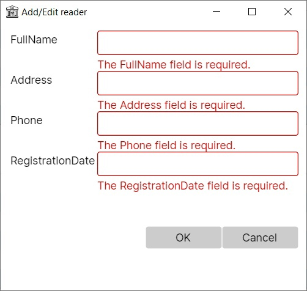
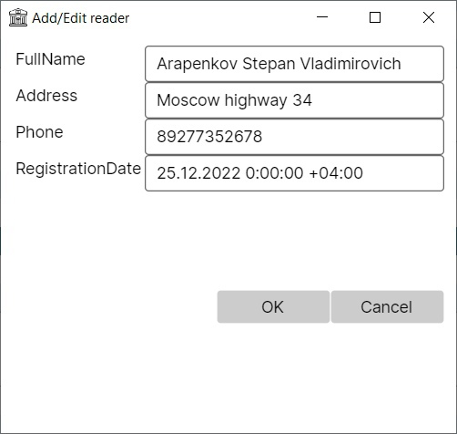

# 24. «Библиотека»

## Исходные данные:
На каждую книгу в библиотеке заведена карточка, содержащая инвентарный номер, шифр в алфавитном каталоге, инициалы и фамилии авторов, название, вид издания (учебное пособие, монография, методические указания), место издания, год издания. В библиотеке есть несколько отделов, каждый отдел хранит информацию о книгах и их количестве.
Библиотека также хранит список читателей (ФИО, адрес, телефон, дата регистрации). При выдаче книги читателю отмечается дата выдачи и количество дней, на которые выдана книга, дату возврата книги.

## Запросы:
1) Вывести информацию о выбранной книге по ее шифру.
2) Вывести информацию о выданных книгах, упорядоченных по названию.
3) Вывести информацию о наличии выбранной книги в разных отделах и количестве.
4) Вывести информацию о количестве книг в различных отделах для каждого типа издания.
5) Вывести информацию о топ 5 читателей, прочитавших больше всего книг за заданный период.
6) Вывести информацию о читателях, задержавших книги на наибольший период времени, упорядочить по ФИО.

## Клиент

