# Промышленное программирование

# Лабораторные работы 2023

## «Таксопарк»

Таксопарк хранит информацию о водителях (ФИО, паспорт, адрес, телефон),
автомобилях (гос.номер, модель, цвет, ...), пользователях сервиса (телефон, ФИО) и
поездках (пункты отправления и назначения, дата поездки, время движения, стоимость, назначенное такси).
Каждый автомобиль закреплен за одним водителем.

### Запросы:

1) Вывести все сведения о конкретном водителе и его автомобиле.
2) Вывести всех пассажиров, совершивших поездки за заданный период,
   упорядочить по ФИО.
3) Вывести количество поездок каждого пассажира.
4) Вывести топ 5 водителей по совершенному количеству поездок.
5) Вывести информацию о количестве поездок, среднем времени и
   максимальном времени поездки для каждого водителя.
6) Вывести информацию о пассажирах, совершивших максимальное число
   поездок за указанный период.

## Реализация клиентского приложения

### Вывод аналитики

### Вывод водителей, окно добавления/редактирования
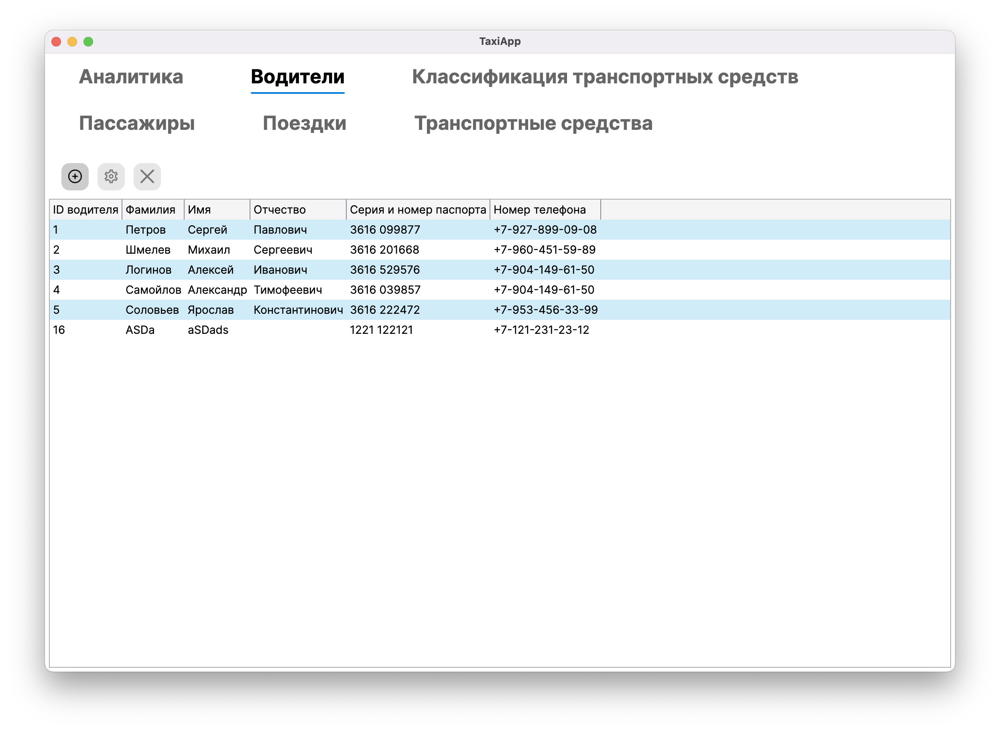
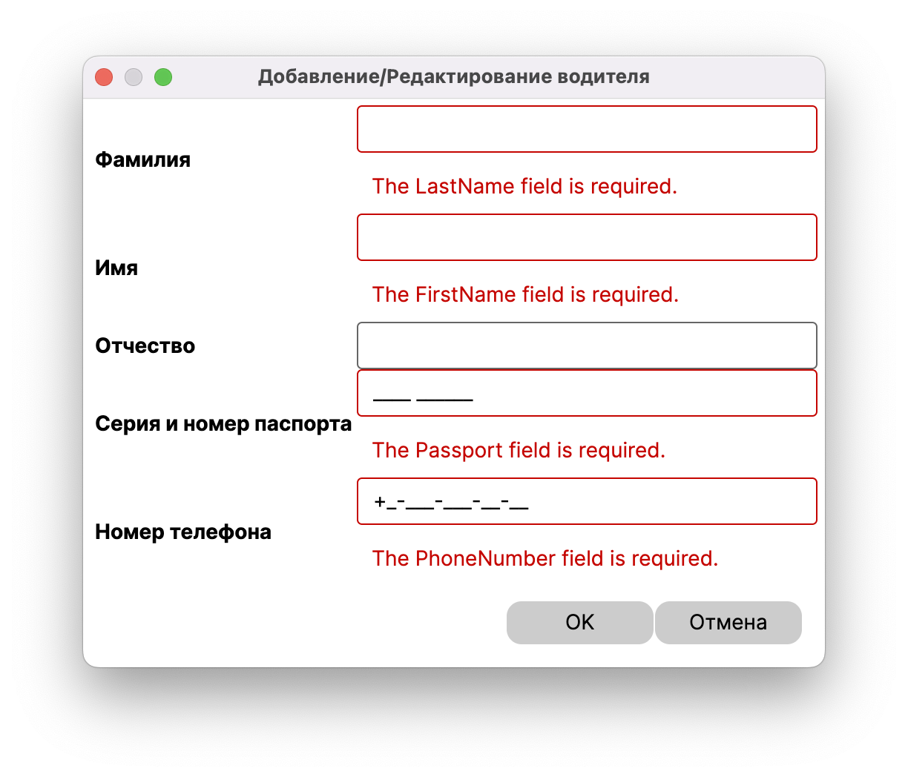
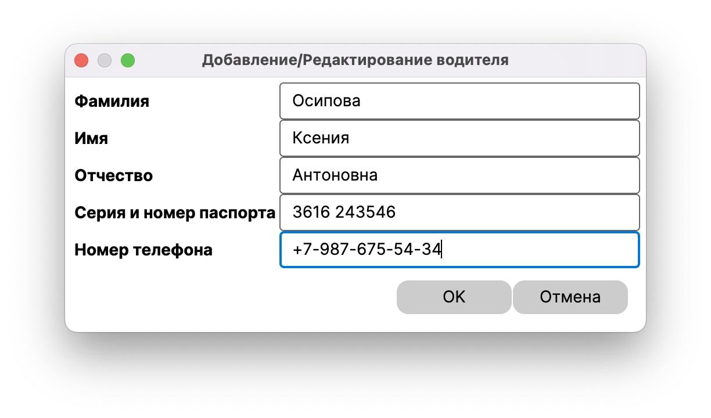

### Вывод классификаций транспортных средств, окно добавления/редактирования
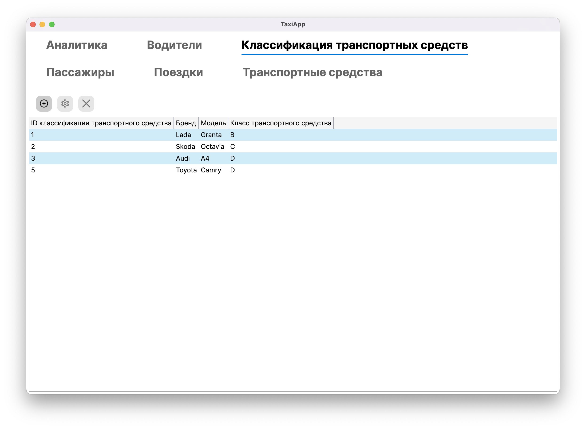
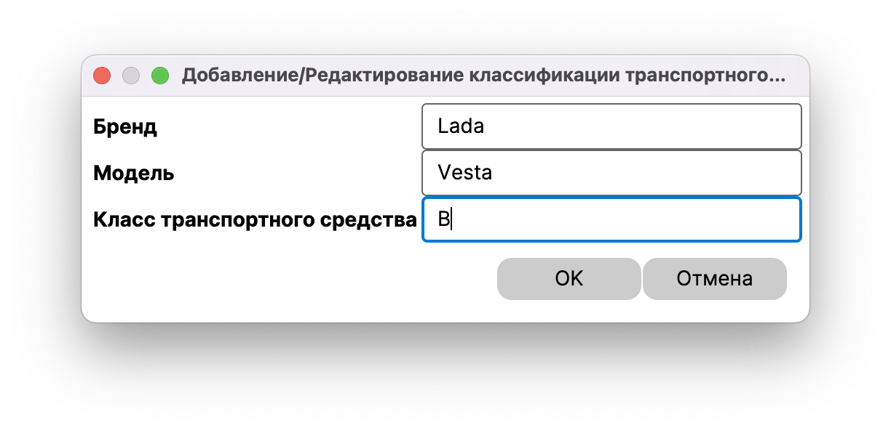

### Вывод пассажиров, окно добавления/редактирования
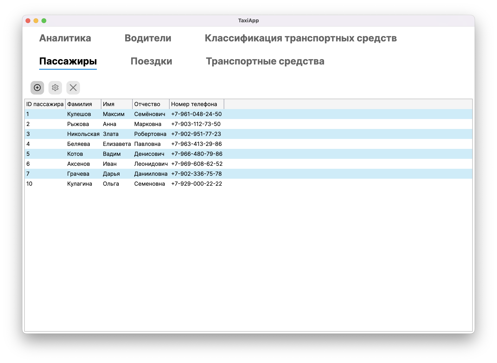
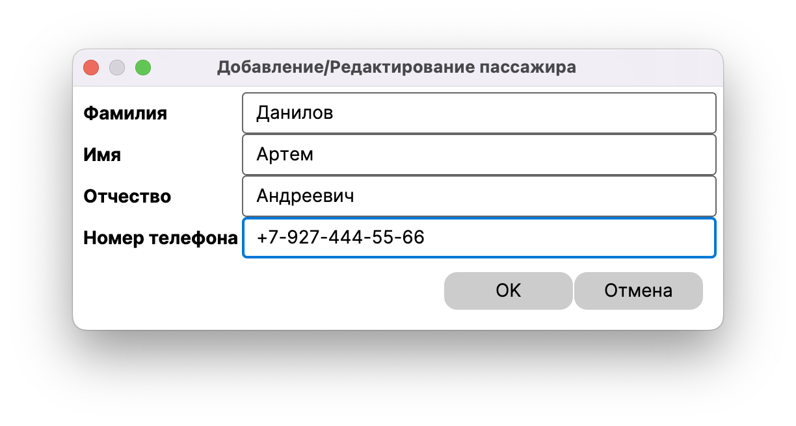

### Вывод поездок, окно добавления/редактирования
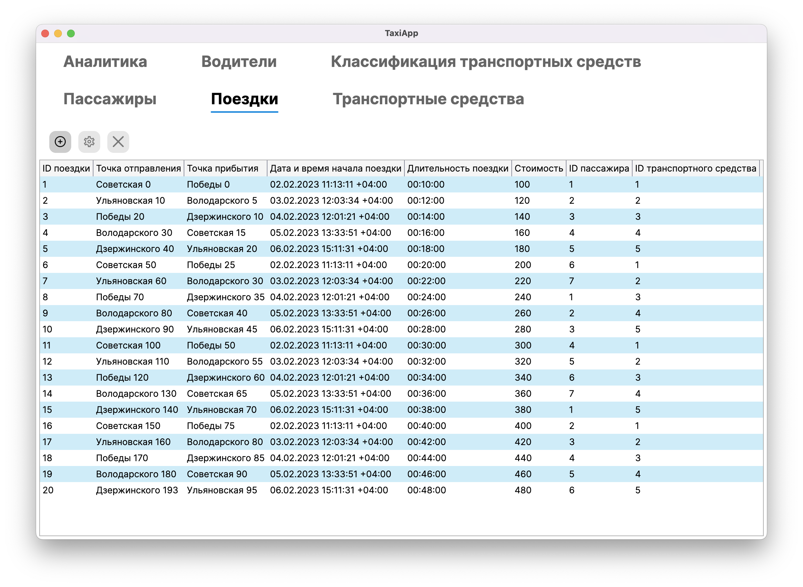
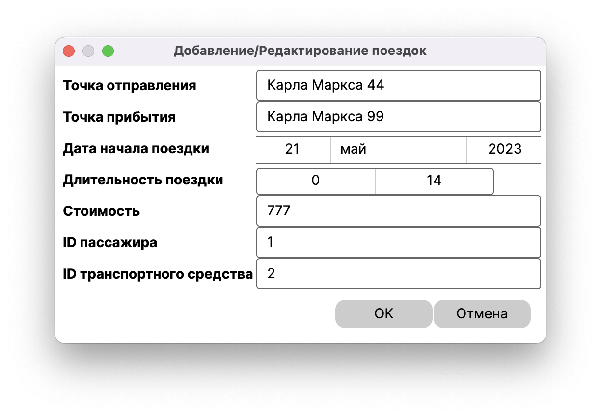

### Вывод транспортных средств, окно добавления/редактирования
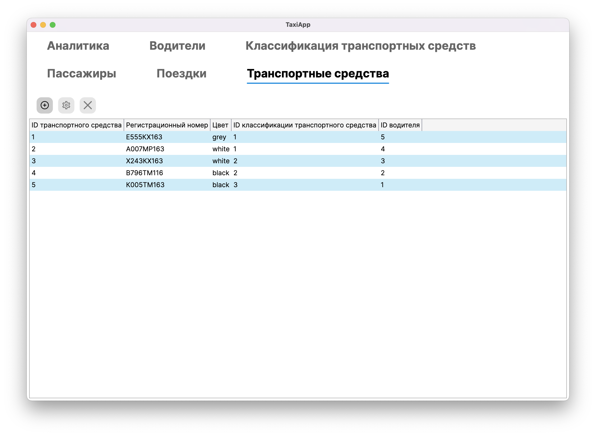
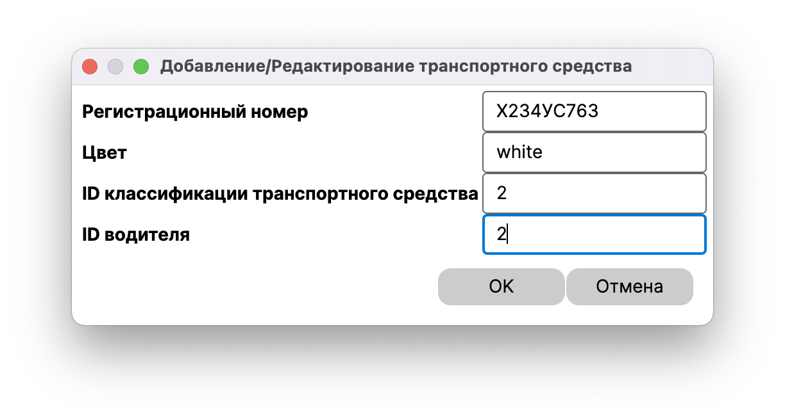