# Промышленное программирование
# Лабораторные работы 2023

## Статистические данные по высшим учебным заведениям города

### Исходные данные

В отделе образования хранится информация обо всех высших учебных 
заведениях города, включая: регистрационный номер, название, адрес, сведения о 
ректоре (ФИО, степень, звание, должность), собственность учреждения 
(муниципальная, частная), собственность зданий (федеральная, муниципальная, частная).

Каждый ВУЗ хранит информацию о факультетах, кафедрах, количестве групп 
по специальностям. Специальность характеризуется шифром и названием и может 
быть общей для разных вузов.

### Запросы 

1) Вывести информацию о выбранном вузе.
2) Вывести информацию о факультетах, кафедрах и специальностях данного 
вуза.
3) Вывести информацию о топ 5 популярных специальностях (с максимальным 
количеством групп).
4) Вывести информацию о ВУЗах с максимальным количеством кафедр, 
упорядочить по названию.
5) Вывести информацию о ВУЗах с заданной собственностью учреждения, и 
количество групп в ВУЗе. 
6) Вывести информацию о количестве факультетов, кафедр, специальностей по 
каждому типу собственности учреждения и собственности здания.

# Графический интерфейс
## Основные окна
### Окно отображения собственностей зданий
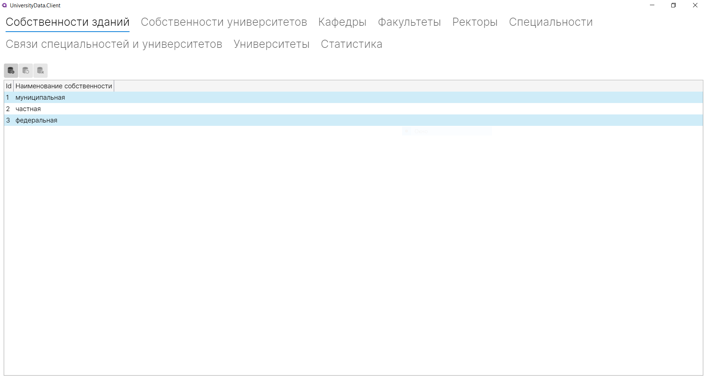
### Окно отображения кафедр
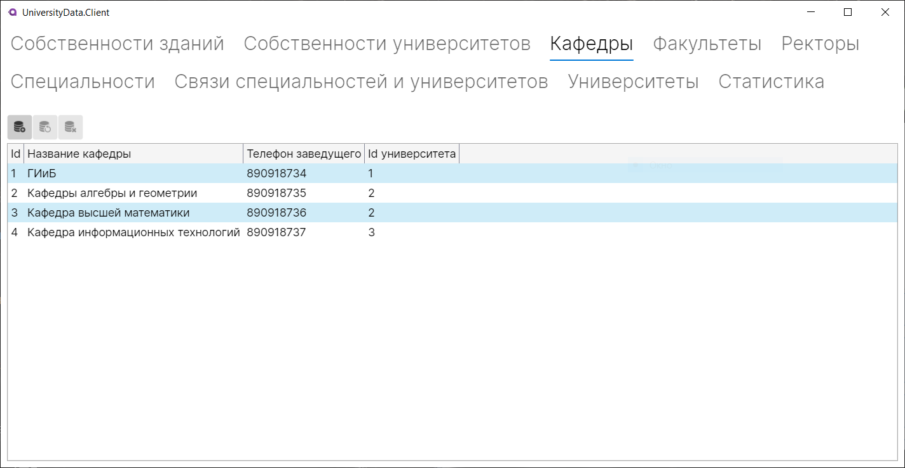
### Окно отображения факультетов
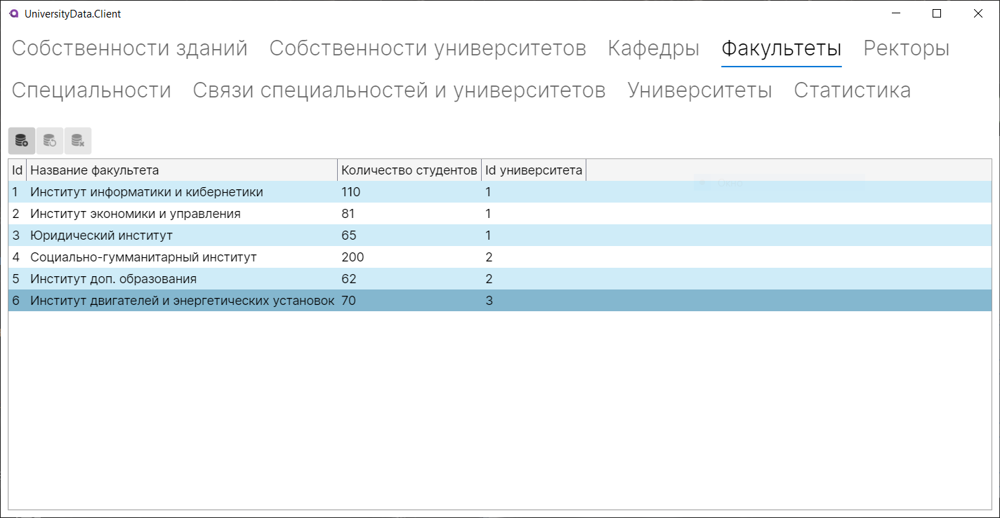
### Окно отображения ректоров
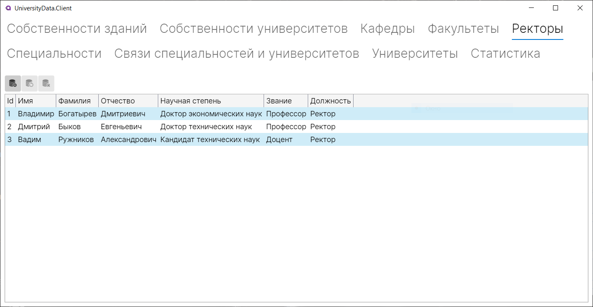
### Окно отображения связи специальностей и университетов
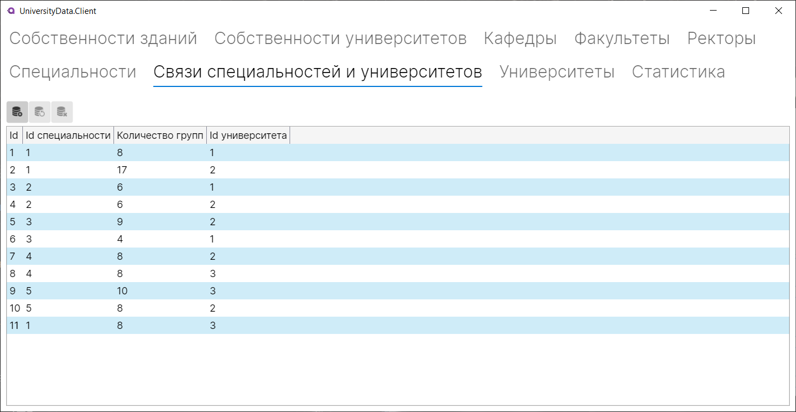
### Окно отображения специальностей
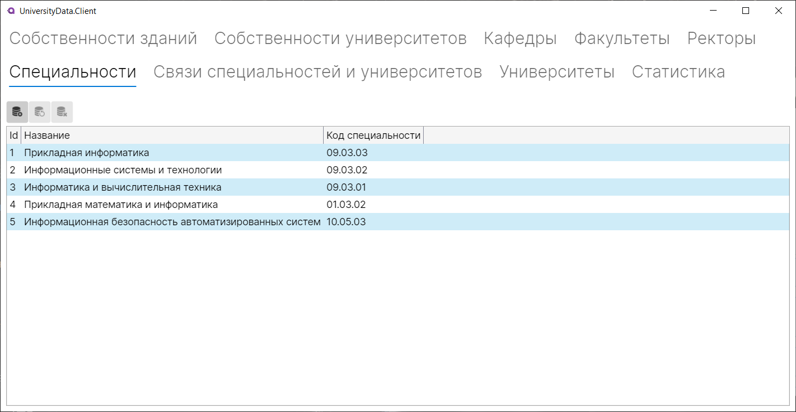
### Окно отображения университетов
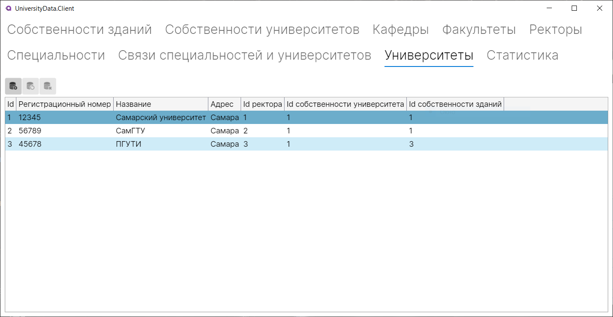
### Окно отображения собственностей университетов
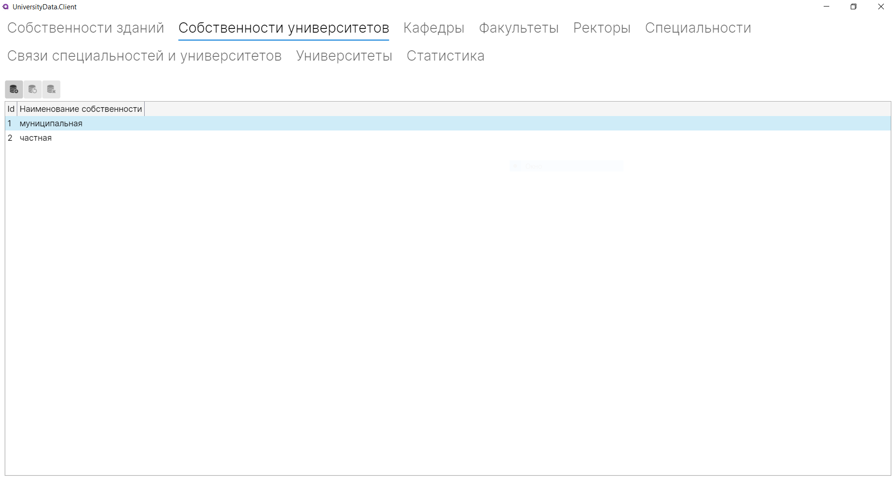
### Окно отображения статистики
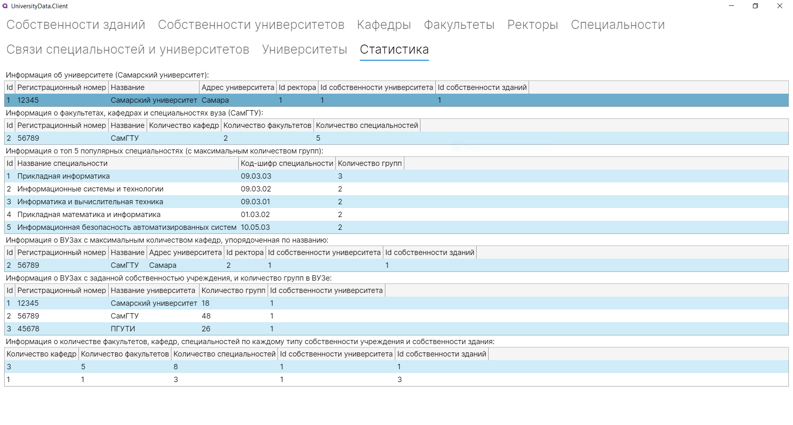

## Окна добавления новых записей
### Окно добавления собственностей зданий
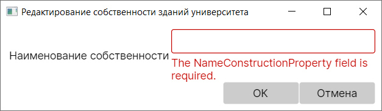
### Окно добавления кафедр
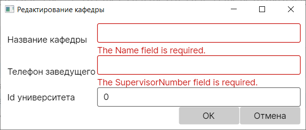
### Окно добавления факультетов
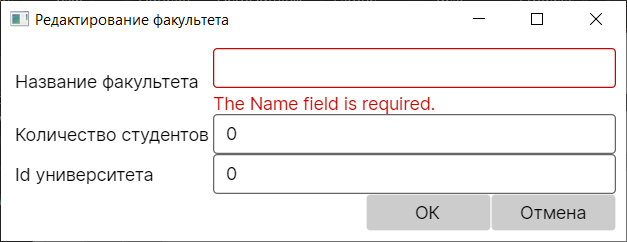
### Окно добавления ректоров
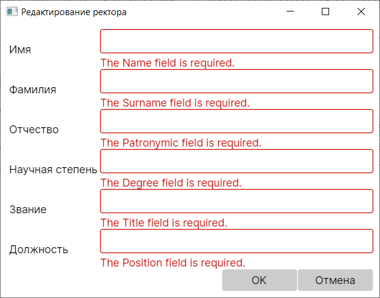
### Окно добавления связи специальностей и университетов
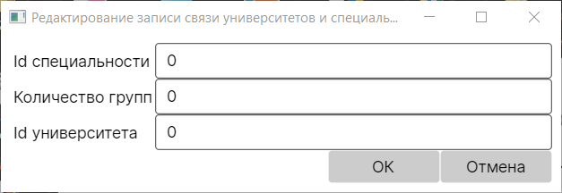
### Окно добавления специальностей
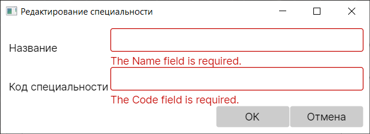
### Окно добавления университето
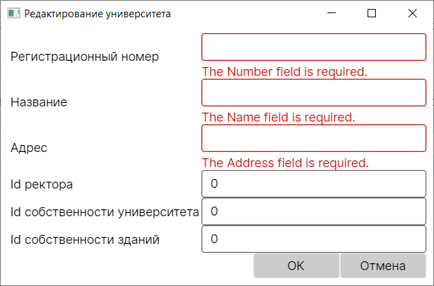
### Окно добавления собственностей университетов

## Окна изменения записей
### Окно изменения собственностей зданий
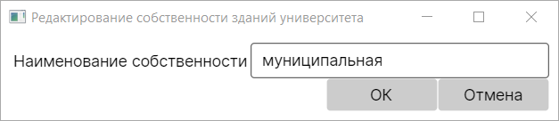
### Окно изменения кафедр
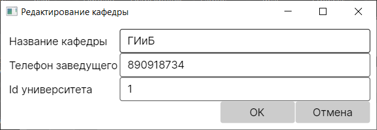
### Окно изменения факультетов

### Окно изменения ректоров

### Окно изменения связи специальностей и университетов
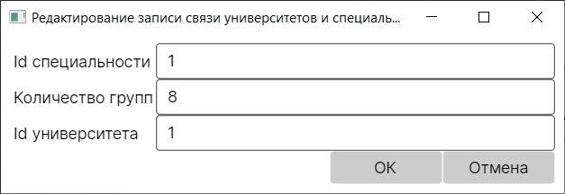
### Окно изменения специальностей
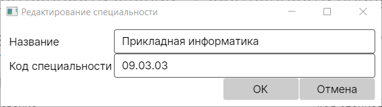
### Окно изменения университетов
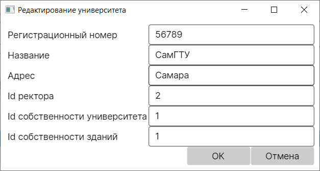
### Окно изменения собственностей университетов
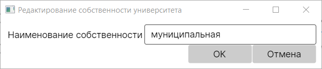

