# Кадры предприятия, вариант 3
### Исходные данные
В отделе кадров предприятия хранятся данные о каждом сотруднике - регистрационный номер, 
фамилия, имя, отчество, дата рождения, пол, дата поступления на работу, цех (справочник), 
отдел (справочник), занимаемая должность (справочник), домашний адрес, телефоны рабочий и домашний, 
семейное положение, число человек в семье, число детей.
Один сотрудник может числиться в нескольких отделах. Отдел кадров хранит
архив данных о трудовой деятельности сотрудника: дата приема на должность,
дата увольнения с должности.

Каждый сотрудник может быть членом профсоюза. Профсоюз хранит
информацию за последние три года о сотрудниках, получивших льготные путевки
в санаторий, дом отдыха и пионерский лагерь предприятия.
Реализация проекта клиент-серверного приложения.

### Запросы:
1) Вывести всех сотрудников выбранного отдела.
2) Вывести сотрудников, работающих в нескольких отделах, упорядочить по
ФИО.
3) Вывести архив об увольнениях, включающий регистрационный номер,
ФИО, дату рождения, цех, отдел, занимаемую должность.
4) Вывести средний возраст сотрудников в каждом отделе.
5) Вывести сведения о сотрудниках, получавших в прошлом году льготные
профсоюзные путевки (с запросом вида путевки).
6) Вывести топ 5 сотрудников, имеющих наибольших стаж работы на
предприятии.

# Графический интерфейс
### Основное окно

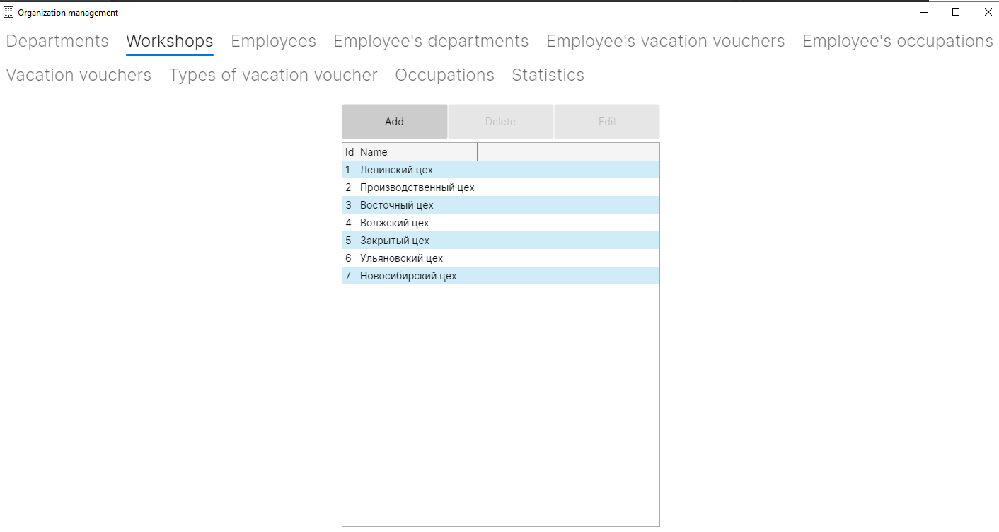
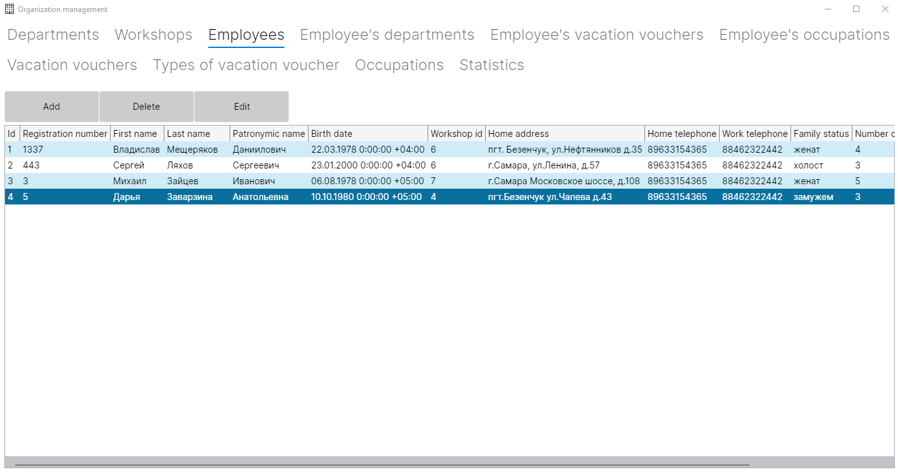
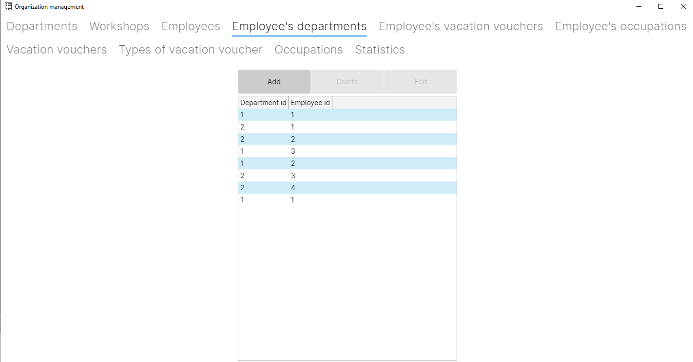
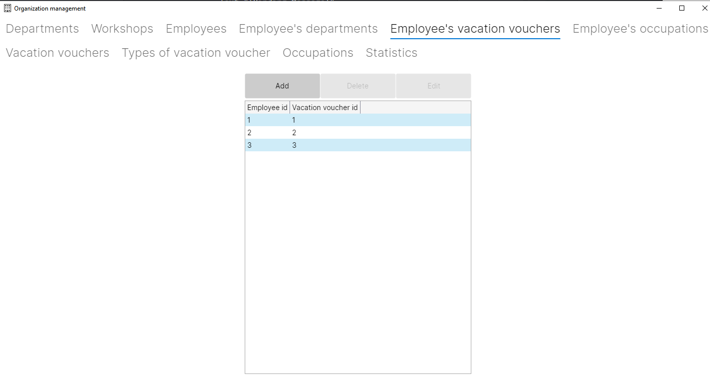
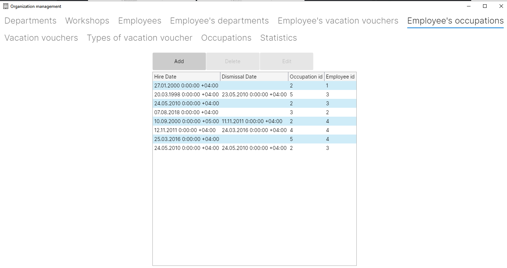
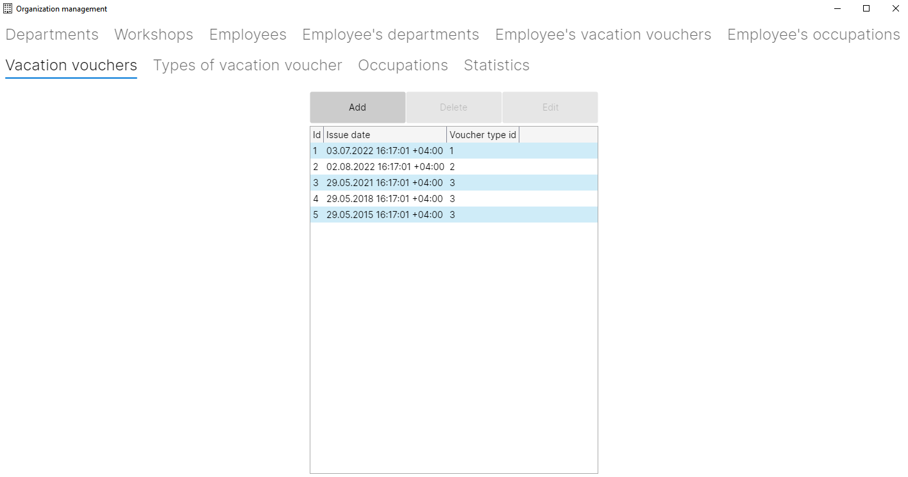
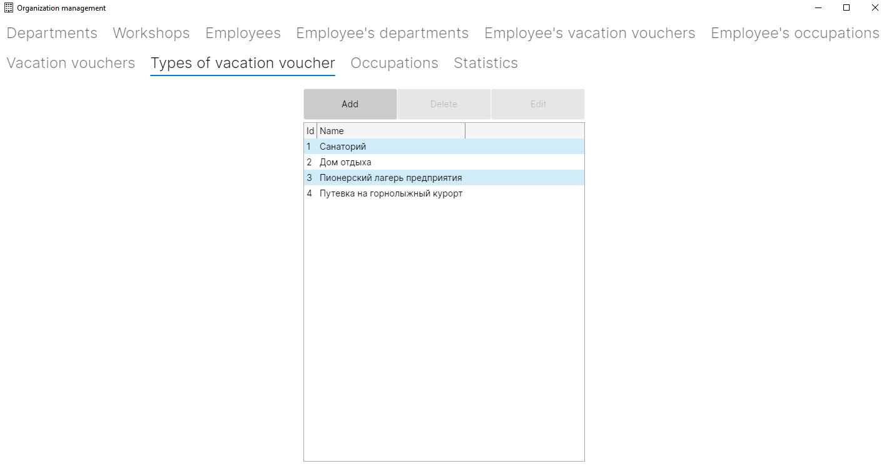
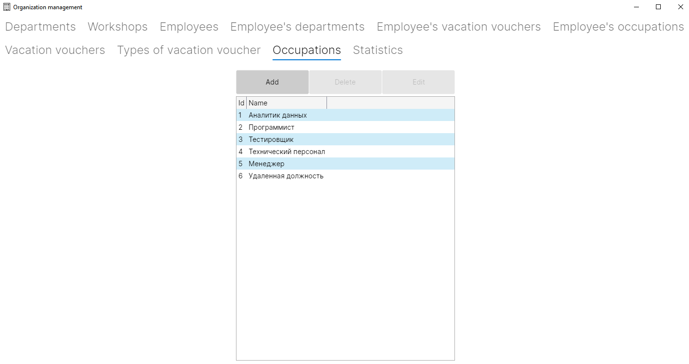

#### Основное окно: отображение статистики
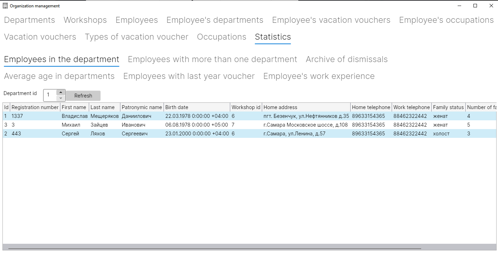
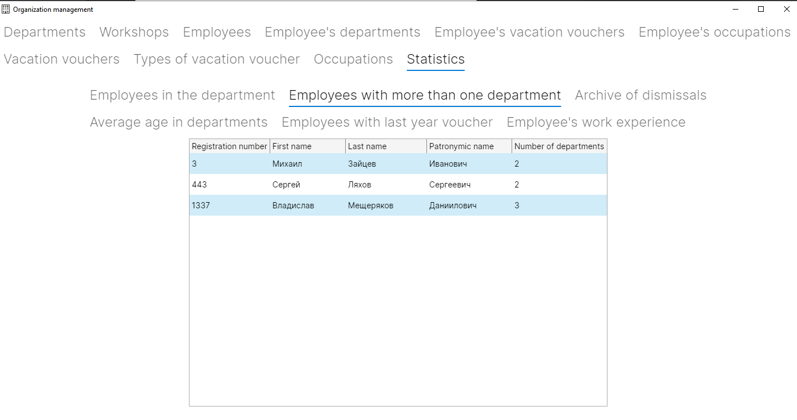
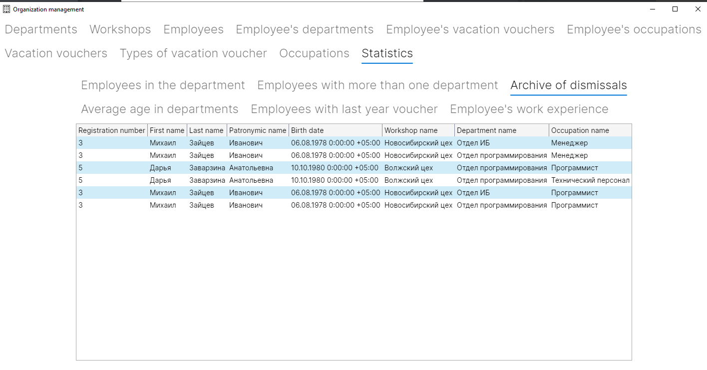

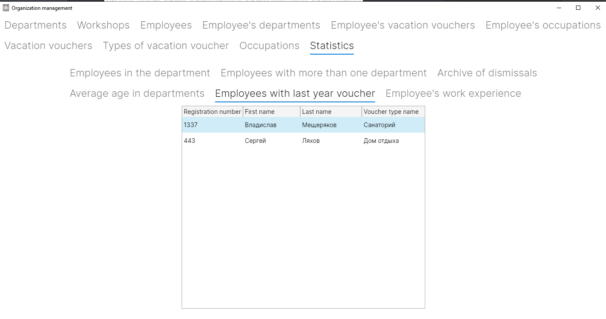
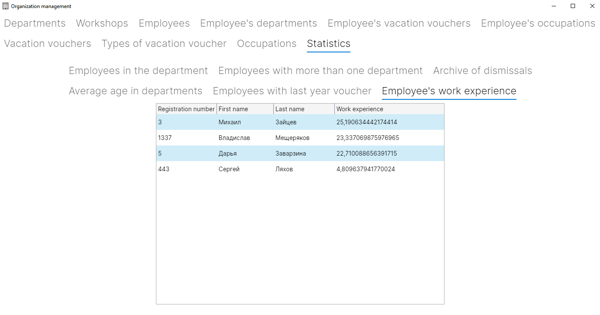

### Окна изменения или добавления отдельных записей таблиц
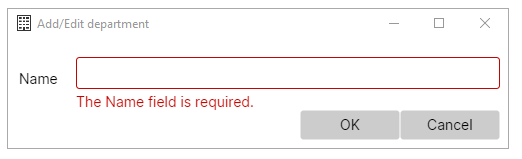
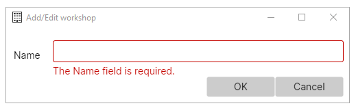
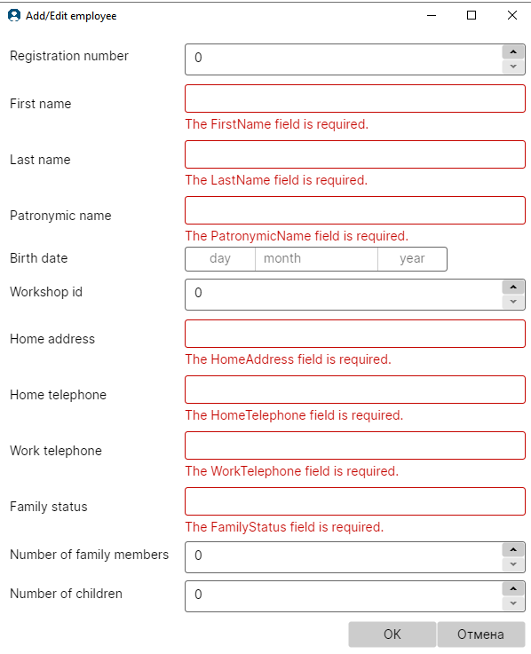
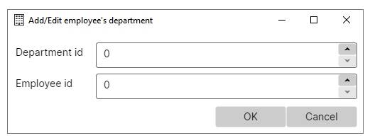
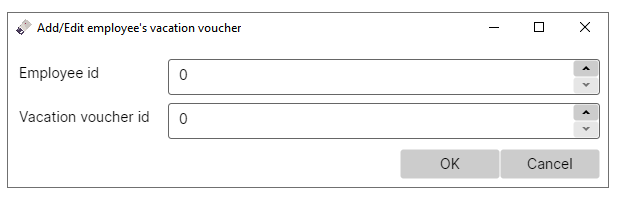

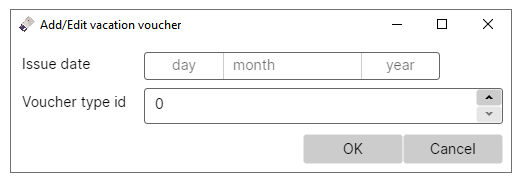
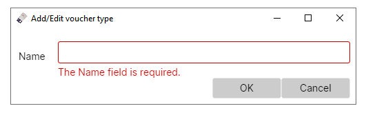
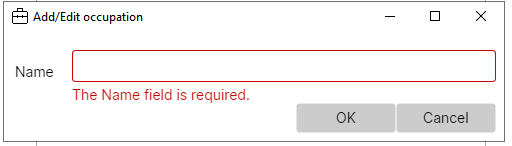

### Примеры окон ошибок
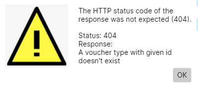
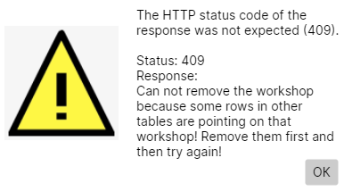
