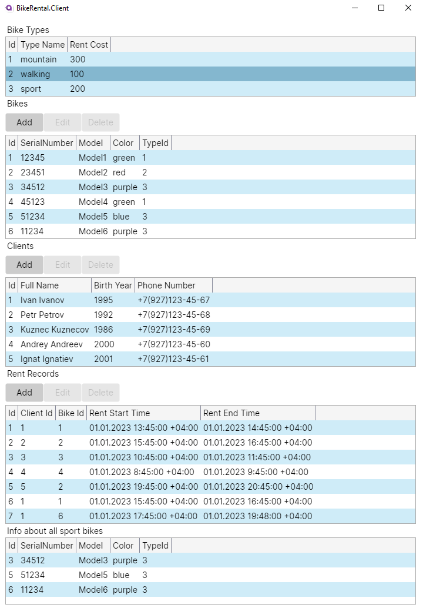
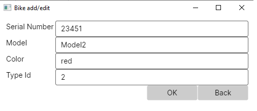
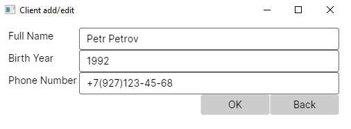
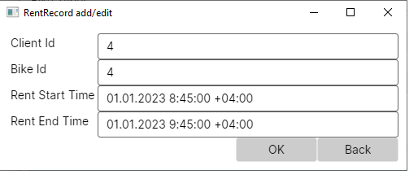

# Велопрокат

В базе данных велопроката содержится следующая информация о 
велосипедах: серийный номер, тип велосипеда (горный, прогулочный, 
спортивный), модель, цвет. Для каждого типа велосипеда определена стоимость 
аренды на час. В базе данных также содержится информация о клиентах: ФИО, 
год рождения, телефон. При аренде велосипеда клиенту выдается велосипед 
нужного типа, фиксируется время начала аренды и назначается время окончания 
аренды.

#Запросы:
1) Вывести информацию обо всех спортивных велосипедах.
2) Вывести информацию обо всех клиентах, которые брали в аренду горные велосипеды, упорядочить по ФИО.
3) Вывести суммарное время аренды велосипедов каждого типа.
4) Вывести информацию о клиентах, бравших велосипеды на прокат больше всего раз.
5) Вывести информацию о топ 5 наиболее часто арендуемых велосипедов.
6) Вывести информацию и минимальном, максимальном и среднем времени аренды велосипедов.

#Клиент

