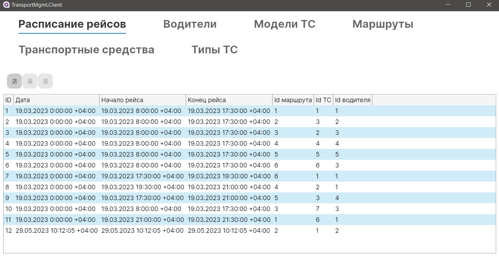
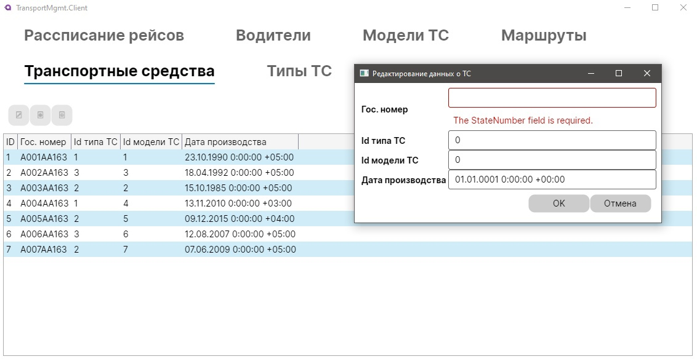

Выполнил: Водянов Степан Денисович, 6311-100503D

# «Диспетчерская служба управления транспортом»

  Исходные данные:
  
    Диспетчерская служба хранит информацию об общественном транспорте и
    порядке его выпуска на маршруты. Каждое транспортное средство характеризуется
    гос.номером, типом транспортного средства (автобус, троллейбус, трамвай),
    моделью (название модели, низкопольный / нет, максимальная вместимость),
    годом выпуска. Система также хранит информацию о водителях (ФИО, паспорт,
    водительское удостоверение, адрес, телефон). Ежедневно для каждого
    транспортного средства назначается водитель, маршрут, время выхода на рейс и
    время окончания рейса.
 
 Запросы:
 
    1) Вывести все сведения о конкретном транспортном средстве.
    2) Вывести всех водителей, совершивших поездки за заданный период,
    упорядочить по ФИО.
    3) Вывести суммарное время поездок транспортного средства каждого типа и
    модели.
    4) Вывести топ 5 водителей по совершенному количеству поездок.
    5) Вывести информацию о количестве поездок, среднем времени и
    максимальном времени поездки для каждого водителя.
    6) Вывести информацию о транспортных средствах, совершивших
    максимальное число поездок за указанный период.
# Демонстрация клиентского приложения:
## Окно вывода информации о расписании рейсов:

## Окно вывода информации о водителях:

## Окно вывода информации о моделях ТС:

## Окно вывода информации о маршрутах:

## Окно вывода информации о транспортных средствах:

## Окно вывода информации о типах ТС:

## Окна для изменения/добавления записей

