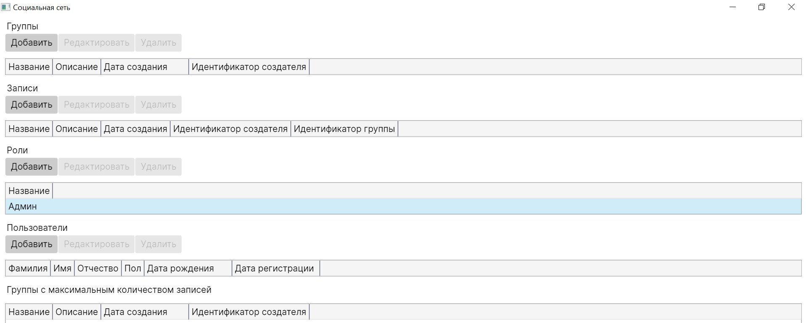
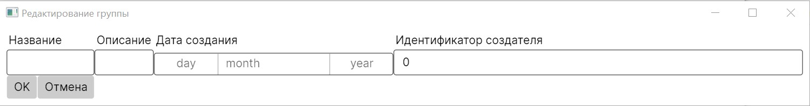

# Социальная сеть

## Задание

Система хранит информацию о пользователях (ФИО, пол, дата рождения, дата регистрации), группах (название, 
описание, дата создания, автор) и записях пользователей в группах (заголовок, описание, дата создания записи,
автор). Каждый пользователь может быть участником нескольких групп с определенными ролями (администратор, модератор, 
соавтор, читаталь).

## Клиентское приложение

